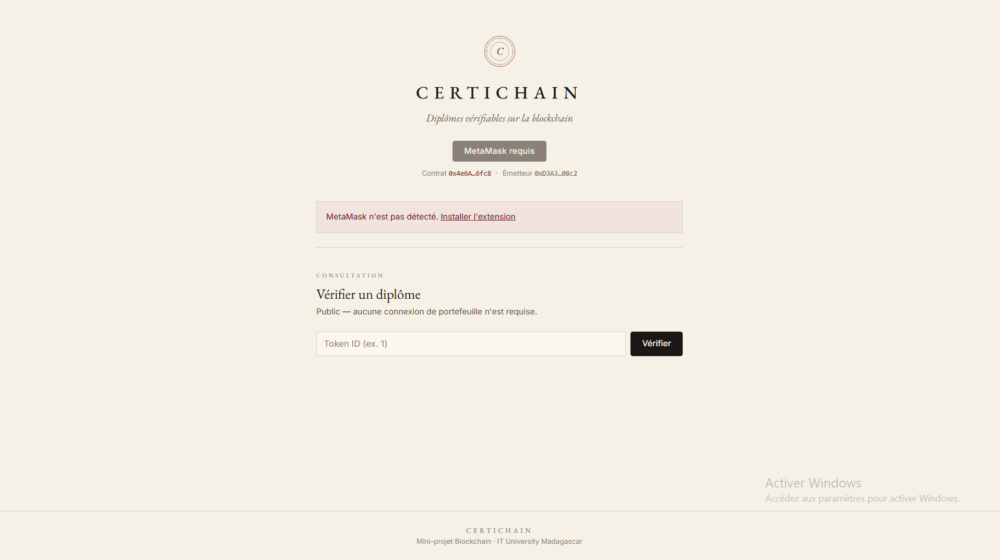
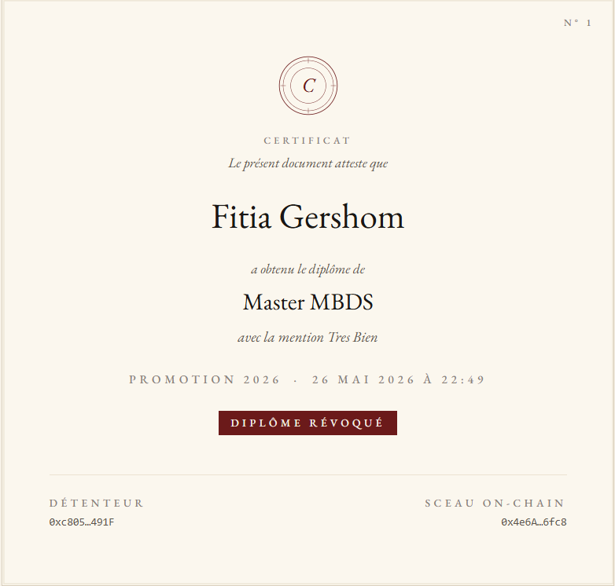
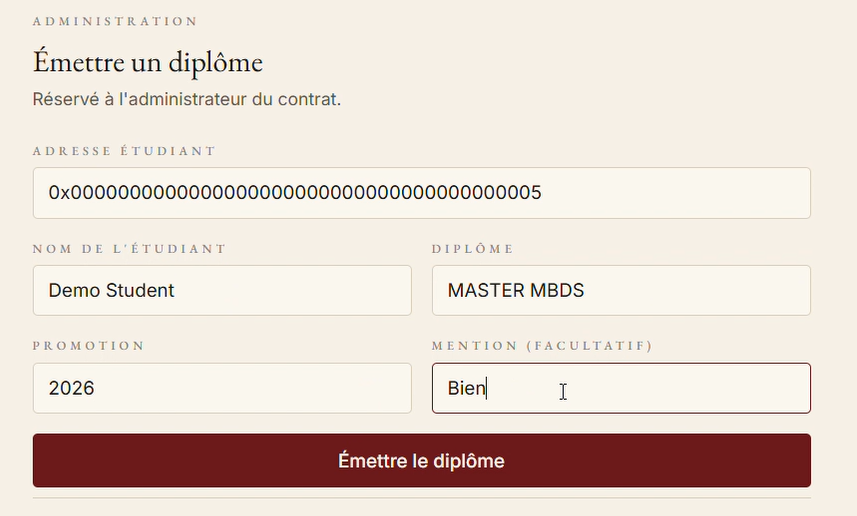
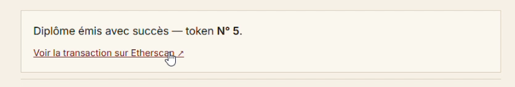
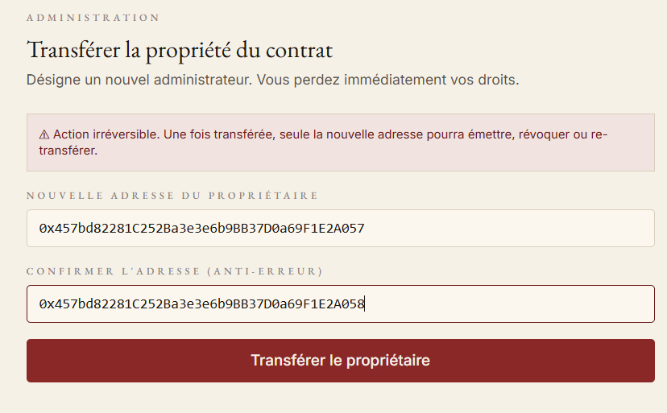

# CertiChain — Diplômes Soulbound vérifiables sur blockchain

> Un diplôme académique scellé sur Ethereum. Émis par l'établissement.
> Détenu à vie par l'étudiant. Vérifiable publiquement, en quelques
> secondes, par n'importe qui.


---

## 🔗 Liens rapides

| Ressource | Lien |
|---|---|
| **DApp en ligne** | [ainanyfitiagershom.github.io/certichain-soulbound-diploma](https://ainanyfitiagershom.github.io/certichain-soulbound-diploma/) |
| **Smart contract sur Sepolia** | [`0x4e6A699603829A64bccabd6Be9e5E5BF61D26fc8`](https://sepolia.etherscan.io/address/0x4e6A699603829A64bccabd6Be9e5E5BF61D26fc8) |
| **Token tracker** | CertiChainDiploma (CCD) |
| **Vidéo de démonstration** | *à venir ([Lien YouTube](https://youtu.be/8JxcL60T1mU))* |
| **Repository GitHub** | [ainanyfitiagershom/certichain-soulbound-diploma](https://github.com/ainanyfitiagershom/certichain-soulbound-diploma) |

---

## 👥 Équipe

Mini-projet réalisé par les étudiants du **M2 MBDS 2025/2026**.

| Membre | Rôle | Livrables |
|---|---|---|
| **ANDRIANAIVOSOA Kanto** | Smart contract Solidity | `contracts/DiplomaSoulbound.sol` (ERC721 + Ownable + Soulbound override + NatSpec) |
| **RAZAFINDRAKOTO Mickael** | Déploiement & validation technique | Setup Hardhat, déploiement Sepolia, tests Remix, génération ABI |
| **GERSHOM Fitia** | Frontend DApp & déploiement public | DApp React + ethers v6 + Tailwind, design certificat académique, hook MetaMask, déploiement GitHub Pages |
| **RAKOTONINDRINA Zo** | Documentation, captures & démonstration | README, screenshots, vidéo de démo |

---

## 🎓 Le problème

Aujourd'hui un diplôme est un PDF ou un papier. Il se **falsifie facilement**,
et vérifier son authenticité oblige à contacter l'établissement et attendre
plusieurs jours pour une réponse.

## 💡 La solution

CertiChain inscrit chaque diplôme sur la **blockchain Ethereum** sous forme
de **NFT Soulbound** (EIP-5114). Un Soulbound est un NFT **non transférable** :
il appartient à vie au wallet de l'étudiant. N'importe qui peut vérifier
publiquement son authenticité en moins de 5 secondes, gratuitement, sans
contacter l'établissement.

---

## 🏛 Architecture

CertiChain suit l'architecture classique en 5 couches d'une DApp :

```text
┌──────────────────────────────────────────────────────────────┐
│  Utilisateur                                                 │
│       │                                                      │
│       │ signe une transaction                                │
│       ▼                                                      │
│  MetaMask  ◄────►  Front-end React + ethers.js (GitHub Pages)│
│                                  │                           │
│                                  │ appels JSON-RPC           │
│                                  ▼                           │
│                       Smart contract DiplomaSoulbound        │
│                       (Solidity / OpenZeppelin)              │
│                                  │                           │
│                                  │ déployé sur               │
│                                  ▼                           │
│                       Ethereum Sepolia (testnet)             │
└──────────────────────────────────────────────────────────────┘
```

| Couche | Rôle | Technologie |
|---|---|---|
| Wallet | Sign les transactions | MetaMask |
| Front | Interface utilisateur | React 19 + Vite + TypeScript + Tailwind v4 |
| Bridge web ↔ chain | Communication blockchain | ethers.js v6 |
| Smart contract | Logique métier immuable | Solidity 0.8.20 + OpenZeppelin 5 |
| Blockchain | Settlement et stockage | Ethereum Sepolia |

---

## ✨ Fonctionnalités

### Côté smart contract

- `issueDiploma(...)` — l'administrateur émet un diplôme vers une adresse étudiant
- `getDiploma(tokenId)` — lecture publique des métadonnées
- `revokeDiploma(tokenId)` — l'administrateur peut révoquer (erreur, fraude…)
- `transferOwnership(newOwner)` — passation d'établissement (hérité d'`Ownable`)
- **Soulbound** — tout transfert est bloqué par un override de `_update()`
- Événements `DiplomaIssued` et `DiplomaRevoked` pour l'indexation

### Côté DApp

| Fonctionnalité | Sans wallet | Avec wallet | Admin uniquement |
|---|---|---|---|
| Vérifier un diplôme (carte certificat stylée) | ✅ | ✅ | ✅ |
| Voir l'émetteur du contrat | ✅ | ✅ | ✅ |
| Détection mauvais réseau + bouton switch | — | ✅ | ✅ |
| Émettre un diplôme | — | — | ✅ |
| Révoquer un diplôme | — | — | ✅ |
| Transférer la propriété du contrat | — | — | ✅ |

---

## 🔒 Sécurité

Le contrat respecte les bonnes pratiques Solidity vues en cours :

- **Modifier `onlyOwner`** sur toutes les fonctions sensibles
- **`require` explicites** avec messages d'erreur lisibles (`"Invalid student address"`, `"Diploma does not exist"`, `"Diploma already revoked"`, `"Soulbound diploma: transfer is not allowed"`)
- **Pattern CEI** (Checks → Effects → Interactions) respecté dans `issueDiploma` et `revokeDiploma`
- **Solidity ≥ 0.8** → protection automatique contre les overflow/underflow
- **OpenZeppelin** utilisé pour `ERC721` et `Ownable` (contrats audités plutôt qu'implémentation maison)
- **`_ownerOf(tokenId) != address(0)`** vérifié avant chaque lecture/révocation

Côté front, validation systématique :

- Adresse étudiant validée avec `ethers.isAddress()`
- Confirmation requise pour le transfert d'ownership (double saisie anti-erreur)
- Détection du réseau actif + bouton automatique pour basculer sur Sepolia
- Cache-bypass du wallet pour la lecture publique (RPC Sepolia public)

---

## 🚀 Installation

### Prérequis

- Node.js **22+** (pour Hardhat 3) ou **20+** (pour le front seul)
- npm
- MetaMask installé dans le navigateur

### Lancer la DApp en local

```bash
git clone https://github.com/ainanyfitiagershom/certichain-soulbound-diploma.git
cd certichain-soulbound-diploma/front
npm install
npm run dev
```

Ouvrir l'URL affichée (généralement `http://localhost:5173`).

### Recompiler le smart contract (optionnel, requiert Node.js 22+)

```bash
npm install          # à la racine du projet
npx hardhat compile
```

---

## 🎮 Utilisation

### 1. Vérifier un diplôme (public, aucun wallet requis)

1. Ouvrir la DApp
2. Saisir un Token ID (par exemple `1` ou `2`)
3. Cliquer **Vérifier**
4. La DApp affiche un certificat avec : étudiant, diplôme, promotion, mention, statut (valide / révoqué), détenteur du NFT

### 2. Connecter MetaMask

- Cliquer **Connecter MetaMask**
- Autoriser la DApp
- La DApp détecte automatiquement si vous êtes sur Sepolia, sinon un bouton vous permet de basculer en un clic

### 3. Émettre un diplôme (administrateur)

L'administrateur (`owner` du contrat) voit apparaître les sections admin. Il peut alors émettre un diplôme :

```solidity
issueDiploma(
    address student,
    string studentName,
    string diplomaName,
    string year,
    string mention
) returns (uint256 tokenId)
```

### 4. Révoquer un diplôme

```solidity
revokeDiploma(uint256 tokenId)
```

Le diplôme reste sur la chain (immuable) mais il est marqué `revoked: true` — la vérification publique affichera dès lors le statut **Révoqué**.

### 5. Transférer la propriété (changer d'administrateur)

L'administrateur peut transférer le rôle à une autre adresse (par exemple pour un changement de directeur d'établissement). Double saisie obligatoire pour éviter les erreurs.

---

## 🧪 Tests

### Tests unitaires automatisés (Hardhat + Mocha + Chai)

13 tests couvrent toutes les fonctions du contrat, organisés en 5 groupes :

```bash
npm test
```

| Groupe | Tests |
|---|---|
| **Émission** | succès owner · refus non-owner · refus adresse 0 · refus nom vide · incrément tokenId |
| **Lecture (`getDiploma`)** | retourne les bonnes métadonnées · revert si tokenId inexistant |
| **Révocation** | succès owner + event · refus non-owner · refus double révocation |
| **Soulbound** | `transferFrom` refusé · `safeTransferFrom` refusé |
| **Ownership** | `transferOwnership` change bien le owner |

Résultat : **13 passing**.

### Tests d'intégration manuels sur Sepolia

| # | Test | Résultat |
|---|---|---|
| 1 | Déploiement du contrat sur Sepolia (Hardhat) | ✅ |
| 2 | Connexion du contrat avec Remix et MetaMask | ✅ |
| 3 | Émission d'un diplôme via `issueDiploma()` | ✅ Token #1, #2 |
| 4 | Lecture publique via `getDiploma()` | ✅ |
| 5 | Révocation via `revokeDiploma()` | ✅ Token #1 |
| 6 | Vérification publique depuis la DApp (sans wallet) | ✅ |
| 7 | Affichage du certificat dans l'interface | ✅ |
| 8 | Tentative de transfert refusée (Soulbound) | ✅ Revert : *"Soulbound diploma: transfer is not allowed"* |
| 9 | Vérification du contrat sur Sepolia Etherscan | ✅ |
| 10 | Transfert d'ownership entre deux wallets | ✅ |

### Diplômes existants sur Sepolia

| Token ID | Étudiant | Diplôme | Mention | Statut |
|---|---|---|---|---|
| `#1` | Fitia Gershom | Master MBDS | Très Bien | 🔴 Révoqué |
| `#2` | Kanto Andrianaivosoa | Master MBDS | Très Bien | 🟢 Valide |

---

## 📸 Captures d'écran

### Accueil de la DApp


### Wallet connecté



### Côté public — Vérification d'un diplôme valide


### Côté public — Diplôme révoqué



### Côté administrateur — Émettre un diplôme



### Côté administrateur — Émission réussie




### Côté administrateur — Révocation d'un diplôme


### Côté administrateur — Transfert de propriété (changement d'établissement)




### Déploiement Hardhat


### Contrat sur Remix


### Lecture `getDiploma` (Remix)


### Contrat sur Sepolia Etherscan


---

## 🏆 Bonus réalisés

| Bonus du sujet | Réalisé |
|---|---|
| **OpenZeppelin** (`ERC721` + `Ownable`) | ✅ |
| **Documentation NatSpec** (`/// @notice`, `/// @param`, `/// @return`) | ✅ |
| **Déploiement du front sur GitHub Pages** | ✅ [URL publique](https://ainanyfitiagershom.github.io/certichain-soulbound-diploma/) |
| **Vérification du contrat sur Etherscan** | ✅ |
| **Tests unitaires Hardhat** (13 tests, tous au vert) | ✅ |

---

## 🗂 Structure du repository

```text
certichain-soulbound-diploma/
├── README.md                        ← ce fichier
├── contracts/
│   └── DiplomaSoulbound.sol         ← smart contract principal
├── test/
│   └── DiplomaSoulbound.ts          ← 13 tests unitaires (Hardhat + Mocha)
├── scripts/
│   └── deploy.ts                    ← script de déploiement Hardhat
├── front/                           ← DApp React
│   ├── index.html
│   ├── package.json
│   ├── vite.config.ts
│   └── src/
│       ├── App.tsx
│       ├── components/              ← formulaires & UI
│       ├── contract/                ← ABI et config
│       └── hooks/useWallet.ts       ← logique MetaMask
├── screenshots/                     ← captures pour la démo
├── hardhat.config.ts
└── package.json
```

---

## 🎬 Démonstration
https://youtu.be/8JxcL60T1mU

Scénario couvert dans la vidéo :

1. Le problème de falsification des diplômes
2. Le contrat CertiChain déployé sur Sepolia (Etherscan)
3. Connexion MetaMask + détection automatique du réseau
4. Vérification publique d'un diplôme (valide puis révoqué)
5. Émission d'un nouveau diplôme côté administrateur
6. Démonstration du caractère Soulbound (transfert refusé)
7. Lien vers la preuve on-chain sur Etherscan

---

## 📜 Licence

Ce projet est un travail académique réalisé dans le cadre du module Blockchain
du M2 MBDS.
