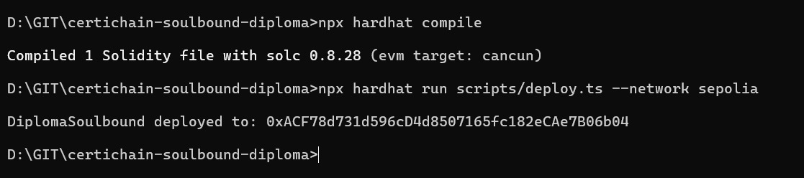
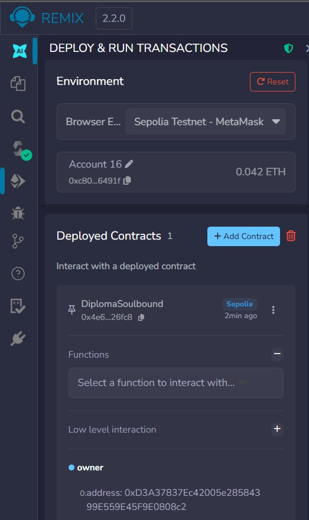
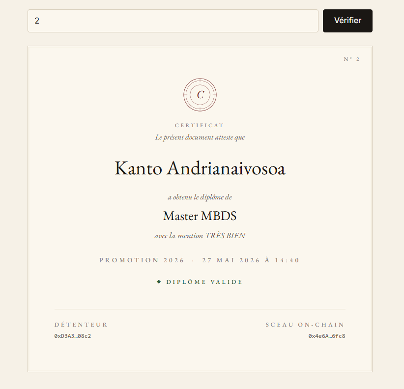
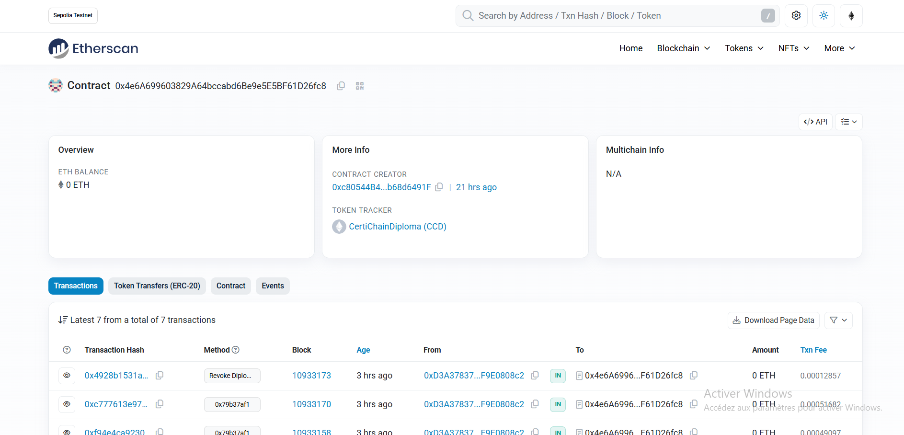
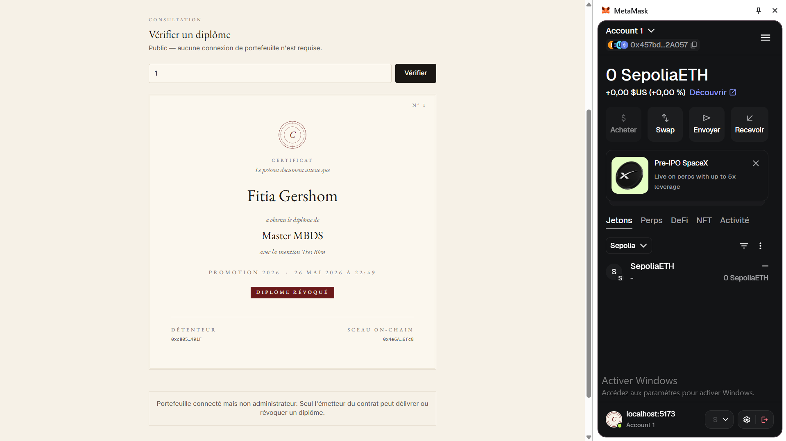
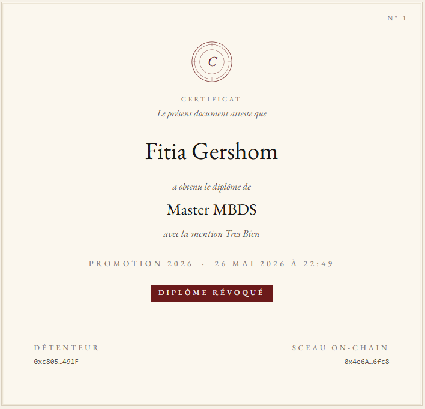

# CertiChain — Diplômes numériques Soulbound

## Présentation du projet

**CertiChain** est une application décentralisée permettant à une école ou une université de délivrer des diplômes numériques vérifiables sur la blockchain.

Le diplôme est représenté sous forme de NFT **Soulbound**, c’est-à-dire qu’il est attaché au portefeuille de l’étudiant et ne peut pas être transféré.

## Problème traité

Les diplômes papier ou PDF peuvent être falsifiés.  
Avec CertiChain, n’importe qui peut vérifier l’authenticité d’un diplôme directement depuis la blockchain Sepolia.

## Fonctionnalités

### Smart contract

Le contrat `DiplomaSoulbound.sol` permet de :

- émettre un diplôme ;
- stocker les informations du diplôme ;
- consulter un diplôme avec son `tokenId` ;
- révoquer un diplôme ;
- empêcher le transfert du diplôme ;
- émettre les événements `DiplomaIssued` et `DiplomaRevoked`.

### DApp

La DApp permet de :

- connecter MetaMask ;
- afficher l’adresse du wallet connecté ;
- vérifier un diplôme publiquement ;
- afficher les informations du diplôme ;
- afficher si le diplôme est valide ou révoqué ;
- permettre à l’administrateur d’émettre ou révoquer un diplôme.

## Technologies utilisées

- Solidity `0.8.20`
- OpenZeppelin ERC721
- OpenZeppelin Ownable
- Hardhat
- Sepolia Testnet
- Ethers.js
- Vite
- MetaMask
- Etherscan

## Structure du projet

```text
certichain-soulbound-diploma/
├── contracts/
│   └── DiplomaSoulbound.sol
├── front/
│   ├── index.html
│   └── src/
├── scripts/
│   └── deploy.ts
├── screenshots/
├── hardhat.config.ts
├── package.json
└── README.md
```

## Contrat déployé sur Sepolia

Adresse du contrat :

```text
0x4e6A699603829A64bccabd6Be9e5E5BF61D26fc8
```

Lien Etherscan :

```text
https://sepolia.etherscan.io/address/0x4e6A699603829A64bccabd6Be9e5E5BF61D26fc8
```

Token tracker :

```text
CertiChainDiploma (CCD)
```

## Installation du projet

Cloner le projet :

```bash
git clone https://github.com/ainanyfitiagershom/certichain-soulbound-diploma.git
cd certichain-soulbound-diploma
```

Installer les dépendances :

```bash
npm install
```

Installer les dépendances du front :

```bash
cd front
npm install
```

Lancer la DApp :

```bash
npm run dev
```

Ouvrir ensuite l’URL affichée, par exemple :

```text
http://localhost:5173
```

## Utilisation

### 1. Connexion MetaMask

- ouvrir la DApp ;
- choisir le réseau **Sepolia** dans MetaMask ;
- cliquer sur **Connecter MetaMask** ;
- autoriser la connexion du wallet.

### 2. Vérifier un diplôme

Dans la zone de vérification :

```text
Token ID : 1
```

Puis cliquer sur :

```text
Vérifier
```

La DApp affiche ensuite les informations du diplôme :

- nom de l’étudiant ;
- diplôme obtenu ;
- année ;
- mention ;
- détenteur ;
- adresse du contrat ;
- statut valide ou révoqué.

### 3. Émettre un diplôme

Seul l’émetteur du contrat peut émettre un diplôme avec :

```solidity
issueDiploma(address student, string studentName, string diplomaName, string year, string mention)
```

### 4. Révoquer un diplôme

Seul l’émetteur du contrat peut révoquer un diplôme avec :

```solidity
revokeDiploma(uint256 tokenId)
```

## Tests réalisés

Les tests et validations suivants ont été réalisés :

- déploiement du contrat sur Sepolia avec Hardhat ;
- connexion du contrat avec Remix et MetaMask ;
- émission d’un diplôme avec `issueDiploma()` ;
- lecture du diplôme avec `getDiploma(1)` ;
- révocation du diplôme avec `revokeDiploma(1)` ;
- vérification publique depuis la DApp ;
- affichage du diplôme dans l’interface ;
- vérification du contrat sur Sepolia Etherscan ;
- tentative de transfert refusée car le diplôme est Soulbound.

## Captures d’écran

### Déploiement Hardhat



### Contrat sur Remix



### Lecture du diplôme avec getDiploma



### Contrat Sepolia sur Etherscan



### Accueil de la DApp


### Vérification d’un diplôme



### Révocation d’un diplôme



## Bonus réalisés

- utilisation de **OpenZeppelin ERC721** ;
- utilisation de **OpenZeppelin Ownable** ;
- diplôme non transférable grâce au principe **Soulbound** ;
- documentation NatSpec dans le contrat ;
- déploiement sur le réseau de test **Sepolia** ;
- vérification sur **Etherscan** ;
- interface DApp connectée à MetaMask ;
- affichage visuel du diplôme sous forme de certificat.

## Répartition du travail

| Membre | Rôle |
|---|---|
| Kanto | Smart contract Solidity |
| Fitia | Frontend DApp |
| Mickael | Déploiement, tests et validation technique |
| Zo | README, captures, design et démonstration |

## Démonstration

La démonstration présente :

1. le problème de falsification des diplômes ;
2. le contrat CertiChain déployé sur Sepolia ;
3. la connexion MetaMask ;
4. la vérification d’un diplôme ;
5. l’affichage du diplôme ;
6. la révocation ;
7. la preuve sur Etherscan.

## Conclusion

CertiChain montre comment utiliser la blockchain pour créer des diplômes numériques vérifiables, sécurisés et non transférables.

Grâce au concept de NFT Soulbound, le diplôme reste lié à son détenteur et peut être vérifié publiquement sans dépendre d’un document papier ou PDF.